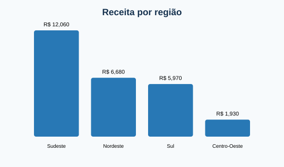

# Análise de Vendas com Python

Estudo de portfólio que demonstra um fluxo reproduzível de análise de vendas com dados fictícios, desde a preparação dos dados até a recomendação executiva.



## Objetivos

- consolidar receita, pedidos e ticket médio;
- comparar o desempenho por região e categoria;
- identificar os produtos com maior faturamento;
- gerar tabelas prontas para apoiar decisões.

## Tecnologias

- Python 3
- pandas

## Como executar

```bash
pip install -r requirements.txt
python analise_vendas.py
```

O programa lê `vendas_exemplo.csv`, calcula os indicadores, grava tabelas em `resultados` e cria `dashboard_vendas.svg`.

## Principais conclusões

- Receita total do período: **R$ 26.640**.
- A região Sudeste lidera com aproximadamente **45% da receita**.
- Tecnologia concentra a maior parte do faturamento, impulsionada por notebooks e monitores.
- O ticket médio é de **R$ 2.664 por pedido**.

## Recomendações executivas

1. Acompanhar margem, e não apenas receita, nas próximas versões.
2. Investigar oportunidades de expansão nas regiões Centro-Oeste e Sul.
3. Criar metas por categoria e alertas mensais de desempenho.
4. Complementar a análise com recorrência e segmentação de clientes.

## Observação

Todos os dados deste repositório são fictícios e foram criados exclusivamente para demonstração.

## Qualidade e contexto de negócio

Execute `python validacao_dados.py` antes da análise para verificar campos obrigatórios, valores inválidos e duplicidades. O contexto gerencial e o impacto esperado estão documentados em `CASO_NEGOCIO.md`.
